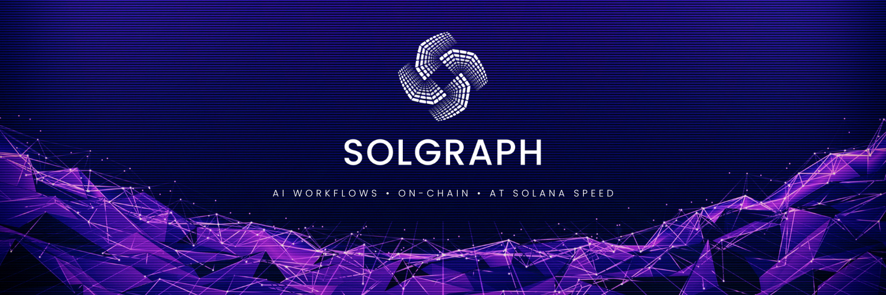

# 🚀 SolGraph: The AI Workflow Protocol for Solana
## 🚀 CA:DEXr8PVkHF3GmZKJpjjYbpeQD5MEVSkCkQzGs5sspump




## 🔗 Overview

**SolGraph is the first AI workflow protocol built for Solana.** It enables developers to compose, execute, and verify AI-powered workflows on-chain with unparalleled speed and transparency. By combining **LangGraph**'s dynamic AI workflows with **Solana's high-performance infrastructure**, SolGraph provides an **open, modular, and trustless execution layer** for AI-driven applications.

### 🔥 Why SolGraph?

🚀 **On-Chain AI Execution** – AI workflows run verifiably on Solana, not in centralized black boxes.

🛠 **Modular & Composable** – AI components work like DeFi legos, enabling powerful, flexible execution.

⚡ **Solana-Powered Speed** – Execute AI workflows at high throughput and low latency.

🔍 **Verifiable & Transparent** – AI decisions can be audited and proven via ZK-powered mechanisms.

🌍 **Hybrid Compute** – Seamlessly bridge **on-chain state** with **off-chain GPU/TPU inference**.


---

## 🧩 SolGraph Stack

### 🔹 **Workflow Orchestration**
> A decentralized AI execution framework built for Solana.

- **Graph-Based AI Execution** – AI workflows structured as verifiable execution graphs.
- **Real-Time State Updates** – Smart contract-driven AI workflows with atomic execution.
- **Open Node Marketplace** – A plug-and-play ecosystem of 200+ pre-built AI nodes.

### 🔹 **Hybrid Compute Engine**
> Solana's state meets off-chain intelligence.

- **On-Chain State Sync** – AI workflows interact with smart contracts in real time.
- **Off-Chain GPU Compute** – Execute intensive AI models with decentralized compute networks.
- **Privacy-Preserving AI** – Confidential VMs + Zero-Knowledge proofs for secure AI execution.

### 🔹 **Zero-Knowledge AI Verification**
> No more AI black boxes—provable intelligence is here.

- **Trustless AI Execution** – AI workflows generate cryptographic proofs of correctness.
- **Verifiable Off-Chain Compute** – ZK-powered validation of AI model outputs.
- **Confidential AI Sandboxing** – Private inference with selective disclosure of results.


---

## ⚙️ How It Works

### **🛠 Build AI Workflows Like Smart Contracts**
SolGraph transforms AI pipelines into **composable execution graphs**, just like smart contracts:

```rust
// Deploy an AI-powered trading bot on Solana
#[solana_program]  
mod trading_flow {  
    fn execute(ctx: Context<Execute>) -> Result<()> {  
        let prices = fetch_pyth_data()?;       // On-Chain Data
        let signal = ai_model::predict(prices); // Off-Chain Inference
        execute_swap(&ctx, signal)?;            // On-Chain Execution
        Ok(())  
    }  
}  
```

### **🌎 Composable AI Modules**
AI workflows in SolGraph are built using **modular, reusable nodes**, such as:

- **LLM Nodes** – Chain-native execution of large language models.
- **Data Retrieval Nodes** – Fetch on-chain & off-chain datasets in real time.
- **Oracle Nodes** – Integrate AI workflows with financial & market data.
- **Autonomous Agent Nodes** – Create self-improving AI execution loops.

### **🔗 Verifiable AI Execution**
Every AI workflow executed on SolGraph can be **verified, audited, and proven**:

- **On-Chain Proofs** – AI outputs generate zk-SNARKs for verifiability.
- **Decentralized AI Nodes** – AI models run on trustless, permissionless networks.
- **Zero-Knowledge Privacy** – AI models execute privately, without data leakage.


---

## 🔧 Getting Started

### **1️⃣ Deploy with Docker Compose**
```bash
# Clone the repository
git clone https://github.com/SolGraphDev/SolGraph.git

# Navigate to the docker directory
cd SolGraph/docker

# Copy the environment configuration file
cp ../.env.example .env

# Start the docker compose
docker compose up -d
```

### **2️⃣ Run Locally**
```bash
# Clone the repository
git clone https://github.com/SolGraphDev/SolGraph.git

# Install dependencies
cd solgraph && pnpm install

# Start development server
pnpm dev
```

### **3️⃣ Smart Contract Deployment**
```bash
anchor build
solana program deploy target/deploy/solgraph.so
```


---

## 📍 Roadmap

✅ **MVP Launch** – Core AI workflow engine & modular execution layer.

✅ **Node Marketplace** – 200+ AI, DeFi, and Oracle-based nodes.

🔜 **ZK-Proof Integration** – Verifiable AI execution using cryptographic proofs.

🔜 **Hybrid Compute Scaling** – Off-chain inference with decentralized GPU clusters.

🔜 **AI Agent Autonomy** – Self-optimizing AI workflows with reinforcement learning.


---

## 👨‍💻 Tech Stack

- **Blockchain:** Solana (Rust, Anchor)
- **AI Workflow Engine:** LangGraph, LangChain
- **Hybrid Compute:** Solana RPC, Off-chain AI execution
- **Verification:** ZK-SNARKs, Solana Verifiable Compute
- **Developer Interface:** React, Next.js


---

## 🌐 Community & Links

- [Website](https://solgraph.dev)
- [GitHub](https://github.com/SolGraphDev/SolGraph)
- [Twitter](https://x.com/SolGraphDotDev)
- [Telegram](https://t.me/solgraph_dev)

---

**SolGraph – The First AI Workflow Protocol for Solana.**
